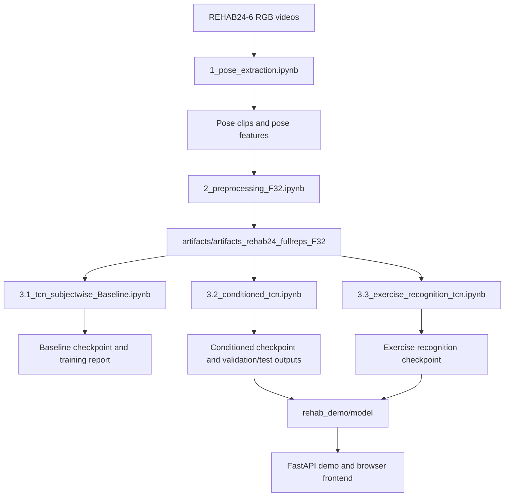
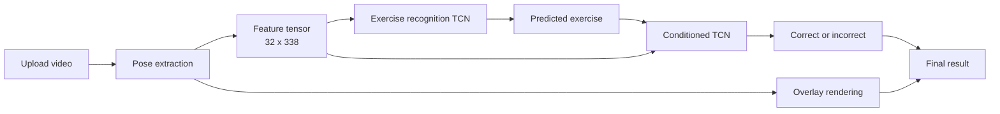
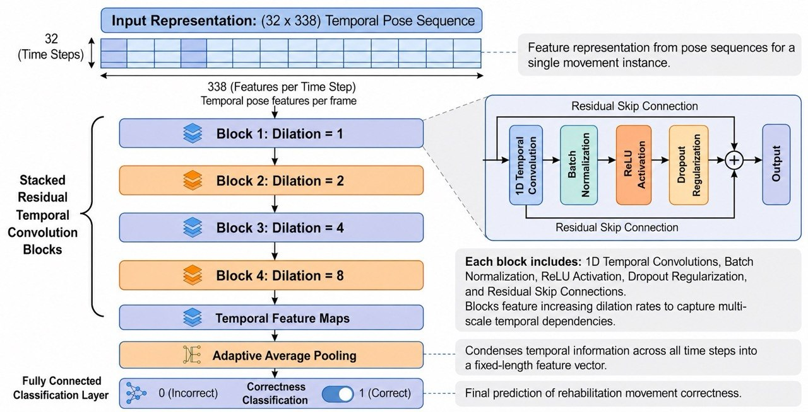
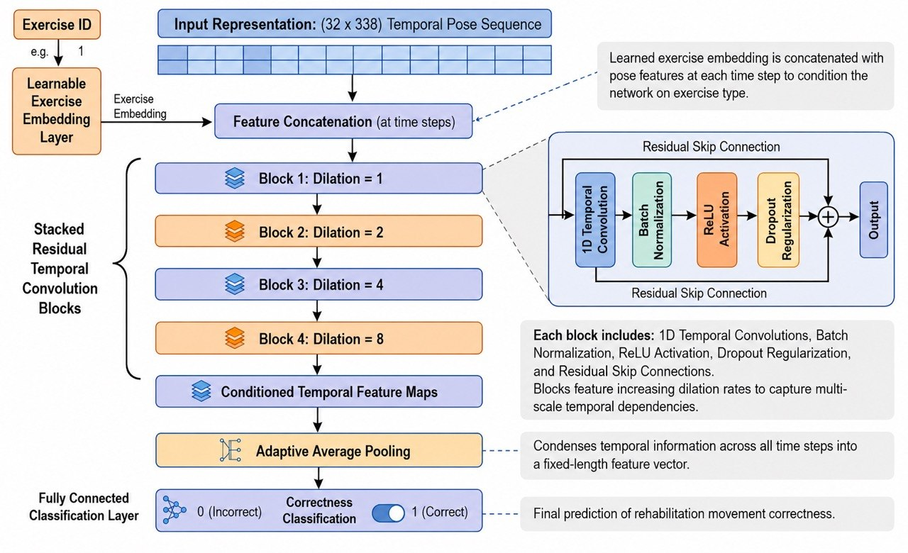
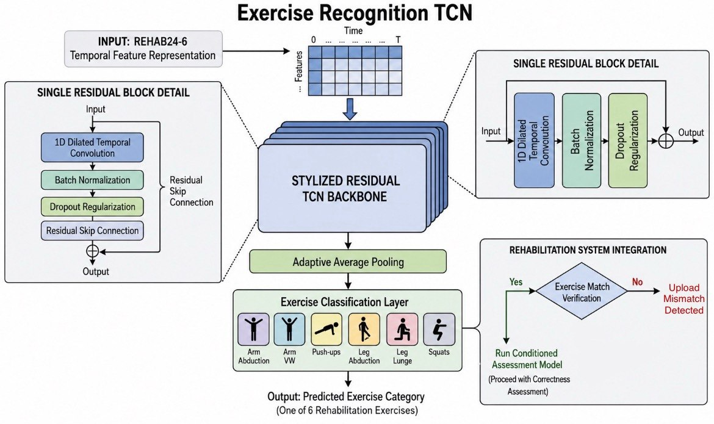
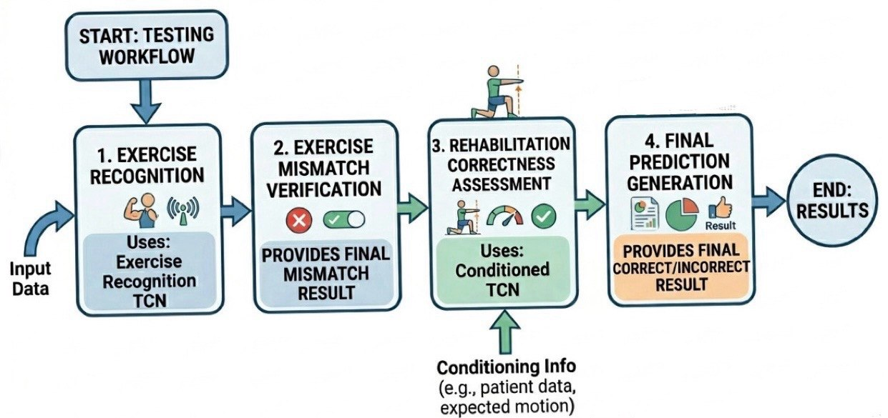

# RecoverAI: AI Driven Tele-Rehabilitation for Home Based Recovery 

The system turns a rehabilitation video into a pose sequence, runs it through temporal convolutional networks, and returns both a classification result and a visual overlay of the analyzed movement. The demo has two connected decisions:

1. Which exercise is being performed.
2. Whether the performed rep looks correct for that exercise.

> **Note:** This system is not guaranteed to be accurate in every case and may produce incorrect predictions.

The repository includes the training artifacts, the FastAPI demo backend, and a browser frontend for uploading clips and viewing the result.


## Environment Setup

The repo was developed with Python 3.9.

### Windows PowerShell

```powershell
python -m venv .venv
.\.venv\Scripts\Activate.ps1
python -m pip install --upgrade pip
pip install -r requirements.txt
```

### macOS / Linux

```bash
python3 -m venv .venv
source .venv/bin/activate
python -m pip install --upgrade pip
pip install -r requirements.txt
```

### PyTorch note

The requirements file pins CUDA 12.8 wheels for development. If you do not have a compatible GPU stack, install the CPU build of PyTorch instead of the `+cu128` packages.

Example CPU install:

```bash
pip install torch torchvision torchaudio --index-url https://download.pytorch.org/whl/cpu
```

### Extra system dependency

- Install FFmpeg if you want overlay MP4 writing to work reliably.
- MediaPipe may need platform-specific wheels depending on your machine.

## Project Map

- `dataset/` - source dataset and video clips used to build the models.
- `artifacts/` - saved training outputs, evaluation CSVs, and dataset summaries.
- `notebook/` - notebooks for pose extraction, preprocessing, and model training.
- `rehab_demo/` - demo app with `backend/`, `frontend/`, and model loading code.
- `rehab_demo/telerehab/` - pose extraction, feature engineering, model definitions, checkpoints, and overlay generation.

## Repository Tree

```text
classRehabFinal/
├── artifacts/
│   ├── artifacts_rehab24_fullreps_F32/
│   ├── conditioned_tcn_Final/
│   └── tcn_subjectwise_Baseline/
├── dataset/
│   └── rehab24-6/
│       ├── pose_clips/
│       ├── videos/
│       ├── clean_segmentation.csv
│       └── Segmentation.csv
├── notebook/
└── rehab_demo/
```


### Pipeline Tree



## Dataset

This project uses the publicly available [REHAB24-6](https://zenodo.org/records/13305826) dataset.

Only the RGB video streams from the dataset were used in this project.


### How To Organize The Dataset

Place the dataset under `dataset/rehab24-6/` so the pipline structure stay aligned with the original structure. A practical layout is:

```text
dataset/rehab24-6/
	videos/
		Ex1/
		    PM_000-Camera17-30fps.mp4
			.
			.
		Ex2/
		Ex3/
		Ex4/
		Ex5/
		Ex6/
	pose_clips/full_reps/camera17
		PM_000_r1_f180-377_pose_full.npy
		PM_000_r2_f378-620_pose_full.npy
		.
		.
		pose_index_full_reps.csv
	clean_segmentation.csv
	Segmentation.csv
```


### Recommended preparation steps:

1. Download the [REHAB24-6](https://zenodo.org/records/13305826) RGB Videos.
2. Extract the RGB video folders into `dataset/rehab24-6/videos/`.
3. Keep the segmentation CSV file in the same dataset folder so the notebooks can match videos to exercise labels and repetitions 
   > **Recomended**: Use clean_segmentation.csv file placed in `dataset/rehab24-6` instead of the segmentation file downloaded with the dataset RGB videos.
   
   > **Note**: Avoid renaming the exercise folders unless you also update the notebook paths and the exercise labels in `telerehab/config.py`.

#### - How The Artifacts Are Generated

4. Run [`1_pose_extraction.ipynb`](notebook/1_pose_extraction.ipynb) to convert the RGB videos into pose clips and intermediate pose representations and saved in `dataset/rehab24-6/pose_clips/full_reps/camera17` so the preprocessing notebook can reuse them.
   > **Note**: Generating pose clips could take up to 6 hours with GPU, although if you are using CPU it could take around 18–36 hours on a normal laptop CPU to fully generate them.
5. After generating pose clips, run [`2_preprocessing_F32.ipynb`](notebook/2_preprocessing_F32.ipynb) to generate `artifacts/artifacts_rehab24_fullreps_F32` folder with all the required files needed including `X_angles.npy`, `X_pose.npy`, `y.npy`, and `index_clean.csv`. 
   > **Note**: Those files are required to train the models.
6. To generate the model artifacts do the same with the models notebooks to generate all their artifacts. 

**How `artifacts` folder should look after genrating all the required files.**
```text
artifacts/
	artifacts_rehab24_fullreps_F32/
		X_angles.npy
		X_pose.npy
		y.npy
		.
		.
	conditioned_tcn_Final/
		best_conditioned_tcn_clean.pt
		best_exercise_recognition_tcn.pt
		.
		.
	tcn_subjectwise_Baseline/
	    best_tcn_subjectwise_Baseline.pt
		.
		.
```

## What The System Does

The system first recognizes the exercise, then uses that exercise label as conditioning information for the correctness model. That separation lets the pipeline answer two different questions: "what movement is this?" and "was it performed correctly?"



This graph is the high-level path the demo follows at inference time. The uploaded clip is turned into pose features, the exercise is recognized first, and that prediction is then used to condition the correctness model before the final result and overlay are returned.

## Models and System Visualizations

The graphs below follow the same sequence as the pipeline: baseline backbone, conditioned correctness model, exercise recognition model, and the final system testing workflow.

### 1) Baseline TCN

This is the residual temporal backbone used as the core pattern extractor for correctness assessment.



Architecture details:

- Input shape: `32 x 338` temporal pose sequence.
- Four residual 1D temporal convolution blocks.
- Dilation grows as `1 -> 2 -> 4 -> 8` to capture short and long temporal patterns.
- Adaptive average pooling condenses the time axis into a fixed-size vector.
- The residual skip path helps preserve stable feature flow through the stack.

### 2) Conditioned TCN

This model predicts whether the movement is correct, but only after it receives the exercise ID.



What makes this model different:

- It uses a learned exercise embedding, not just raw pose features.
- The embedding is concatenated at every time step, so the network learns exercise-aware temporal patterns.
- The same residual backbone is reused, which keeps the model compact while still capturing multi-scale motion.

### 3) Exercise Recognition TCN

This model predicts one of the six rehabilitation exercises from a temporal pose tensor.



Architecture details:

- Input shape: `32 x 338` temporal pose sequence.
- Four residual 1D temporal convolution blocks.
- Dilation grows as `1 -> 2 -> 4 -> 8` to capture short and long temporal patterns.
- Adaptive average pooling condenses the time axis into a fixed-size vector.
- Final linear head outputs the exercise class among:
	- Arm Abduction
	- Arm VW
	- Push-ups
	- Leg Abduction
	- Leg Lunge
	- Squats

## System Testing Workflow

The demo follows a simple staged test workflow that matches the frontend and backend result fields.



In practice, the frontend shows the following sequence:

- Select an exercise from the supported list.
- Upload a video clip.
- Extract pose frames and build features.
- Run exercise recognition.
- Verify whether the selected exercise matches the detected movement.
- If the match is valid, run the conditioned correctness model.
- Return the final result plus an overlay video.

The result payload includes:

- predicted exercise name and ID
- exercise match flag
- correctness prediction and confidence
- probabilities and threshold information
- optional overlay video URL


## How To Run Everything

### 1. Start the backend API

From the project root:

```powershell
cd rehab_demo/backend
uvicorn main:app --reload --host 127.0.0.1 --port 8000
```

Or, from the project root, run the module directly:

```powershell
python rehab_demo/backend/main.py
```
> **Note**: Keep the terminal open and running the backend while trying to run the frontend, both should be running at the same time to run the entire demo successfully.

The backend serves:

- `GET /api/exercises` for the supported exercise list.
- `POST /api/classify` for video inference.
- `/overlay/{filename}` for generated overlay MP4 files.

### 2. Open the frontend

You can open the frontend in either of these ways:

- Install `Live Server` Extension.
- Open `rehab_demo/frontend/index.html`, then right click and chose `open with Live Server`

- Or serve the folder with a local HTTP server:

```powershell
cd rehab_demo/frontend
python -m http.server 8080
```

Then open `http://127.0.0.1:8080`.

### 3. Run a prediction

1. Choose one of the six supported exercises.
2. Upload a short rehabilitation video.
3. Wait for the pipeline to finish pose extraction and inference.
4. Review the predicted exercise, correctness label, confidence, and overlay video.

## API Reference

### GET /api/exercises

Returns the exercise catalog as JSON.

### POST /api/classify

Multipart form fields:

- `video` - uploaded video file
- `exercise_name` - selected exercise name

Allowed video extensions:

- `.mp4`
- `.mov`
- `.avi`
- `.mkv`
- `.webm`
- `.m4v`

Example:

```bash
curl -F "video=@./clip.mp4" -F "exercise_name=Arm Abduction" http://127.0.0.1:8000/api/classify
```

## Important Files

- `rehab_demo/telerehab/pose.py` - pose extraction from video.
- `rehab_demo/telerehab/features.py` - feature construction and normalization.
- `rehab_demo/telerehab/model.py` - Exercise TCN and Conditioned TCN definitions.
- `rehab_demo/telerehab/checkpoint.py` - checkpoint loading and model assembly.
- `rehab_demo/telerehab/overlay.py` - overlay rendering.
- `rehab_demo/backend/api.py` - API endpoints.
- `rehab_demo/backend/main.py` - FastAPI app entry point.
- `rehab_demo/testVideo/correct_arm_abduction.mp4` - you can use this video after running the demo to test it. 

## Trained Artifacts

The main checkpoints are stored in `rehab_demo/model/`:

- `best_exercise_recognition_tcn.pt`
- `best_conditioned_tcn_clean.pt`

Matching artifacts and reports are also available under `artifacts/`.

## Troubleshooting

- If the backend cannot read the video, verify the file path and make sure FFmpeg is installed.
- If MediaPipe import fails, reinstall dependencies in a fresh environment and confirm you are using Python 3.9.
- If PyTorch complains about CUDA, switch to a CPU wheel or install wheels that match your local CUDA version.
- If overlay generation fails, check the `av` and FFmpeg installation first.

## Contribution

- **Affiliation:** Computer Engineering Department, College of Computer Science & Information Technology, Imam Abdulrahman Bin Faisal University, Dammam, 31441, Saudi Arabia.
- **Official RecoverAI website / repository:** [RecoverAI-app](https://github.com/RaghadAljiban/RecoverAI-app)